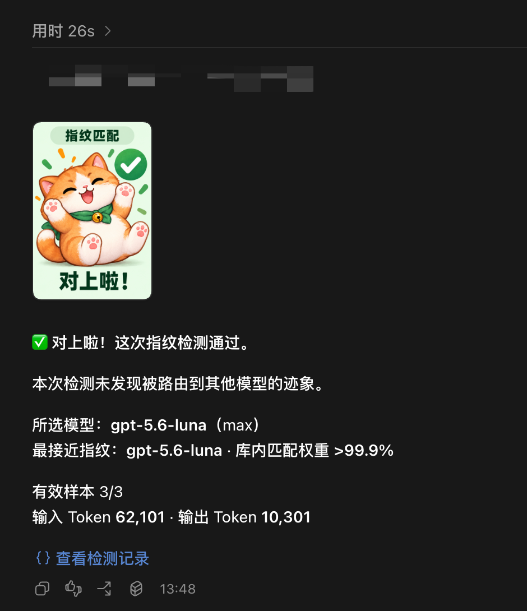
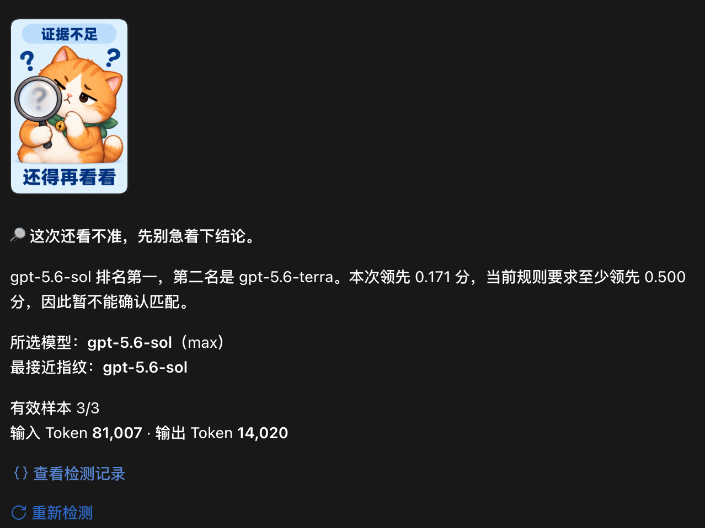
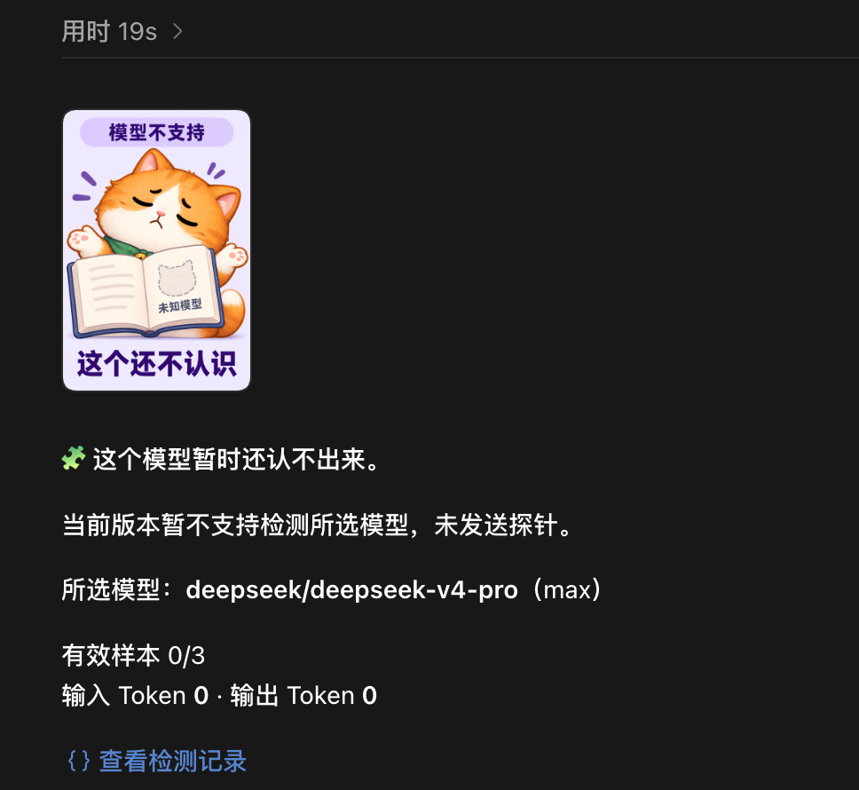

# gpt-model-check

[简体中文](README.md) | [English](README.en.md)

**Type `$gpt-model-check` in Codex to check whether your selected GPT's behavioral fingerprint matches the reference bank.**

The skill uses your current task's model, provider, and reasoning effort. It collects probe responses, compares them locally, and displays the result. No manual copying of answers or separate API key for a detection service is required.

This is an experimental **model fingerprinting tool**. It can provide clues about a possible model substitution. It is not an IQ test, a code-quality benchmark, or proof of the model running behind an endpoint.

## What you get

After installation, select a model in the Codex task you want to check and send `$gpt-model-check`. These are actual Codex Desktop screenshots. The model IDs, sample counts, and token figures have been checked against the corresponding local detection records.

### Match: this check passed

<p>
  
</p>

The selected model is `gpt-5.6-luna`, and the closest reference fingerprint is also `gpt-5.6-luna`. **All three samples are valid and the current decision thresholds are met.** The displayed `>99.9%` is a relative weight among candidates in the reference bank, not the tool's accuracy or proof of model identity.

**Next step:** This check found no sign of model substitution. Continue using your model, or click **View detection record** (`查看检测记录`) to inspect the configuration, raw responses, and scores in the right sidebar.

### Inconclusive: ranked first, but the evidence is insufficient

<p>
  
</p>

Here, `gpt-5.6-sol` is both the selected model and the top candidate, and all three samples are valid. However, it leads the runner-up, `gpt-5.6-terra`, by only **0.171 points**, below the required **0.500 points**. Ranking first does not by itself meet the decision rules. This result establishes neither a match nor a substitution.

**Next step:** Click **Run again** (`重新检测`), the text link with a circular arrow. It sends a new detection message to the current task, collects fresh samples, and produces a new result. The client may ask for confirmation. A recheck consumes tokens; it does not just refresh or replay the previous result.

### Unsupported: this model is outside the tool's current coverage

<p>
  
</p>

The selected model is `deepseek/deepseek-v4-pro`, which is outside the tool's supported GPT set, so **no probes were sent**. The `0/3` samples and zero input/output tokens mean sampling did not run; they do not indicate a problem with DeepSeek.

**Next step:** To use this tool, select a GPT from its supported list in Codex and send `$gpt-model-check`. Repeated checks of the same unsupported model will not extend coverage.

The screenshots include displays of previously saved results. Token figures belong to the corresponding probe runs, not the entire conversation. The turn duration at the top may include a replay and should not be used to estimate how long a new check takes.

Result messages and illustrations currently use Chinese; the explanations above and instructions below are in English.

## Install

You need **Node.js 18+** and **Codex Desktop or Codex CLI** with working model access. A maintained Node.js LTS release is recommended. There are no third-party npm runtime dependencies and no `npm install` step.

### Ask Codex to install it

Send this message to Codex:

```text
Use $skill-installer to install the skill at the root of https://github.com/Katao123/gpt-model-check, with the name gpt-model-check.
```

Then send `$gpt-model-check` in a new turn. If it does not appear, reopen Codex. If your client does not provide skill-installer, use the manual installation below.

### Download and install — macOS and Windows

Download the ZIP from [Releases](https://github.com/Katao123/gpt-model-check/releases/latest), extract it, and open a terminal in the extracted `gpt-model-check` directory:

```sh
node install.mjs
```

If you have Git:

```sh
git clone https://github.com/Katao123/gpt-model-check.git
cd gpt-model-check
node install.mjs
```

The default installation directory is `.codex/skills/gpt-model-check` under your home directory. If `CODEX_HOME` is set, its `skills` directory is used instead. The installer does not change your Codex model, authentication, or global configuration.

### Run a check

1. Select the GPT you want to check in a Codex task.
2. Send `$gpt-model-check`.
3. Read the result. If it is inconclusive, use **Run again** in a supported Desktop client.

Invoke the skill inside the task you want to check: a regular terminal cannot automatically identify the Codex task you are viewing. You can use it in an existing long conversation. By default, probes run in three fresh temporary sessions without copying that conversation's history.

### Update or uninstall

Download and extract the latest release, or run `git pull` in your clone, then:

```sh
node install.mjs --update
```

The installer backs up the previous skill in `.codex/gpt-model-check/backups/` and preserves detection records and the local usage counter. To uninstall, delete `.codex/skills/gpt-model-check`. To also remove records and local state, delete `.codex/gpt-model-check`. Use the corresponding paths if you set `CODEX_HOME`.

## Supported models and cost

The pinned reference bank contains **13 candidates**. This version supports checks for these **six GPT model IDs**:

`gpt-6-astra` · `gpt-5.6-sol` · `gpt-5.6-luna` · `gpt-5.6-terra` · `gpt-5.5` · `gpt-5.4`

Other candidates participate only in comparisons. If your selected model is not one of these six, the tool reports it as unsupported and sends no probes. It uses IDs returned by your Codex runtime and does not reinterpret third-party aliases as GPT models.

Each check starts up to three probes and consumes tokens or account quota through your existing provider. **Fresh sessions do not guarantee low token usage:** the runtime still supplies system and tool context. Cost varies by client, model, and reasoning effort. Results show reported usage; if some requests time out without returning usage, only known totals are shown.

| Environment | Validation so far |
| --- | --- |
| macOS + Codex Desktop | Live sampling and result display have been exercised |
| Codex CLI | Runtime discovery and protocol support are provided; compatibility must be checked for individual versions |
| Windows / Linux | Cross-platform scripts and CI tests are provided; live client operation has not yet been verified end to end |

The tool depends on Codex's native `app-server` interfaces for reading task configuration and creating temporary sessions. Older or third-party clients may lack these interfaces. Connection or compatibility failures are reported as execution problems, not evidence of model substitution. Installing Codex Desktop does not guarantee that a terminal-accessible Codex CLI is also installed on every platform.

## How it works

```text
Read the current task's model and provider
    → Create three temporary sessions without conversation history
    → Ask the model to return number arrays without using tools
    → Extract statistical features and compare them with the pinned bank locally
    → Display the result and save a detection record
```

Models can exhibit different statistical patterns when asked to generate numbers. This project reuses ModelTrace's reference bank and scorer, adding Codex integration, sample validation, decision rules, and result presentation.

| Result | Current rule |
| --- | --- |
| ✅ Match | All three samples are valid; the top candidate is the selected model; its relative weight is at least 80%; its raw score leads the runner-up by at least 0.5 |
| ⚠️ Mismatch | All three samples are valid; a different candidate meets the same strength requirements; the selected model has a weight of at most 20% and trails the top candidate by at least 0.5 raw score points |
| 🔎 Inconclusive | Samples are incomplete, weights or score margins are insufficient, or the selected configuration changed during the check |
| 🧩 Unsupported | The selected model is outside the tool's supported set; no probes are sent |
| 🔧 Execution failed | A connection, protocol, or model-request failure occurred; this does not establish model substitution |

**A relative candidate weight is not the probability that the model's identity is genuine.** An unlisted model may resemble a known fingerprint. The 80% and 0.5 thresholds are experimental, conservative rules, not accuracy guarantees calibrated on independent real-world samples. The Chinese/English probes and current Codex context have not been calibrated under identical conditions either. Passing software tests verifies program behavior, not detection accuracy.

A weight near 100% can still produce an inconclusive result if samples are missing or the raw score margin is too small. The output explains the reason and hides the potentially misleading percentage in these cases. A match does not establish how previous requests were routed or whether coding quality has changed.

## Local records and optional Star invitation

Records are saved in `.codex/gpt-model-check/reports/`. They include model configuration, raw probe responses, scores, reported usage, and upstream versions. They may contain local paths and task IDs, so review them before sharing.

The optional Star invitation uses only a local counter and the last invitation time in `.codex/gpt-model-check/usage.json`:

- A check that starts a real probe counts once. Rechecks count too; three probes within one check still count as one use.
- No invitation appears during the first three uses. From the fourth use onward, a result with a match, mismatch, or inconclusive verdict has a 25% chance of including an invitation.
- Invitations are separated by at least three more checks and 24 hours. Execution failures do not show an invitation.
- Historical replays, `doctor`, unsupported-model checks, and runs that start no probes do not count.
- Counts are not uploaded. The feature collects no account or device identifiers, does not check whether you have starred the repository, and never opens or clicks GitHub automatically.

Set `GPT_MODEL_CHECK_STAR_PROMPT=0` and restart Codex to disable invitations. Deleting `usage.json` resets the local counter. Updates do not scan older detection records to backfill usage counts.

## Troubleshooting and development

Inside the target Codex task, ask Codex to run:

```text
node "<skill-dir>/scripts/check.mjs" doctor
```

Replace `<skill-dir>` with the absolute installation path. `doctor` checks connectivity and model coverage without calling a model. If runtime discovery fails, use `--codex "<absolute-executable-path>"` or set `GPT_MODEL_CHECK_CODEX_PATH`. On Windows, point to `codex.exe` or `@openai/codex/bin/codex.js`, not a `.cmd` wrapper.

Other commands, run from the project directory:

```text
node scripts/check.mjs models
node scripts/check.mjs render --receipt "<absolute-record-path>"
node scripts/check.mjs --json
npm test
```

`render` replays a saved record offline and labels it as historical; it sends no new probes. The default timeout is 180 seconds; `--timeout` accepts 5–600 seconds. `--context current` copies the context of a completed turn into three temporary branches and may substantially increase cost. Use it only for a deliberate comparison that needs the existing conversation.

To report a problem, [open an issue](https://github.com/Katao123/gpt-model-check/issues) with your OS, Node/Codex versions, selected model, and sanitized error details. Do not attach credentials, full conversations, or unreviewed local records.

## Upstream projects and license

Thanks to both upstream projects. The fingerprinting method originates upstream:

| Project | Contribution used here | Pinned version |
| --- | --- | --- |
| [ModelTrace](https://github.com/xqy2006/ModelTrace) | Reference fingerprint bank, statistical scorer, and numerical probe method | [`3f0dd2f`](https://github.com/xqy2006/ModelTrace/commit/3f0dd2f4b451ad424f3b165a108a468efe4d4d81) |
| [is-gpt-nerfed](https://github.com/kiyoakii/is-gpt-nerfed) | Reference for Codex native temporary-fork integration and probe execution | [`3849867`](https://github.com/kiyoakii/is-gpt-nerfed/commit/38498671b32015b97901717207d38b4508b57301) |

Pinned upstream code and data are bundled; they are not fetched automatically at runtime. You do not need to install either upstream project separately. See [THIRD_PARTY_NOTICES.md](THIRD_PARTY_NOTICES.md), [version and SHA-256 metadata](assets/provenance.json), and the retained MIT license files.

This project is released under the [MIT License](LICENSE) and is independent of OpenAI and the upstream projects. Contributions to client compatibility, independent calibration samples, and result presentation are welcome.
